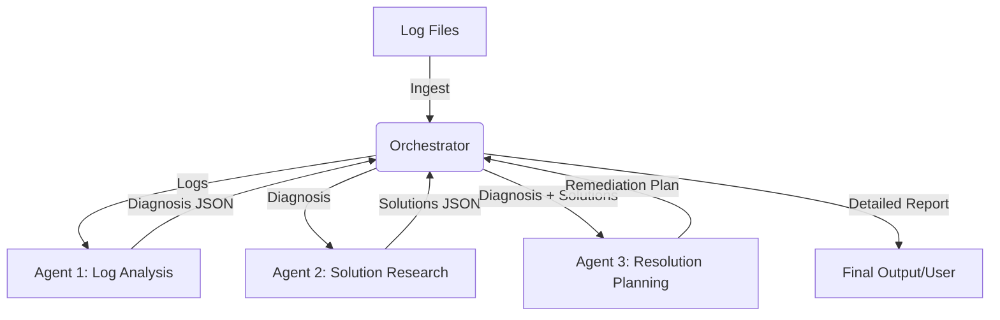

# Incident Response System

A multi-agent system designed to automate the diagnosis and remediation planning for production API incidents.

## Tech Stack

- Programming Language: Python 3.13
- LLM Provider: Groq (llama-3.3-70b-versatile)
- Configuration: python-dotenv
- Core Libraries: groq, requests, json

## Function

The system serves as an automated first-responder for site reliability engineers. It processes raw server logs (Nginx and Application) to identify the root cause of service degradations, researches industry-standard solutions, and generates a validated remediation plan to restore service.

## Workflow Diagram

## Flow

1. Log Ingestion: The orchestrator identifies and reads logs from the /logs directory.
2. Agent 1 (Log Analysis): Processes log content using the Groq LLM to identify errors, timeouts, and resource exhaustion patterns. It outputs a structured diagnosis.
3. Agent 2 (Solution Research): Receives the diagnosis and performs technical retrieval from a knowledge base of technical sources to find relevant fixes (e.g., connection pooling, resource scaling).
4. Agent 3 (Resolution Planning): Evaluates the root cause and the researched solutions to create a practical, step-by-step remediation plan including pre-checks and validation steps.
5. Reporting: The system consolidates all agent outputs into a final incident response report.

## Setup

1. Create and activate a virtual environment:
   python3 -m venv venv
   source venv/bin/activate

2. Install the necessary dependencies:
   pip install -r requirements.txt

3. Configure the environment:
   Create a .env file in the root directory and add your Groq API key:
   GROQ_API_KEY=your_api_key_here

4. Execute the system:
   python3 main.py

## Agent Boundaries

- Agent 1 is focused on evidence extraction and diagnosis.
- Agent 2 is restricted to technical retrieval to ensure solutions are grounded in verified sources.
- Agent 3 is focused on operational safety and step-by-step execution logic.
