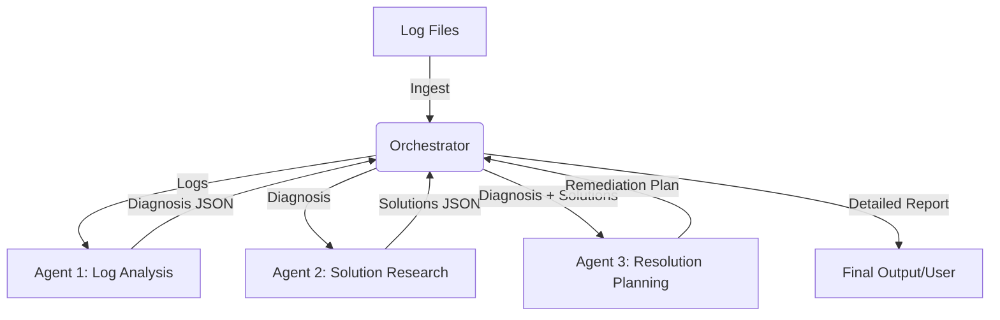

# Incident Response System

A multi-agent system designed to automate the diagnosis and remediation planning for production API incidents.

## Tech Stack

- Programming Language: Python 3.13
- LLM Provider: Groq (llama-3.3-70b-versatile)
- Configuration: python-dotenv
- Core Libraries: groq, requests, json

## Function

The system serves as an automated first-responder for site reliability engineers. It processes raw server logs (Nginx and Application) to identify the root cause of service degradations, researches industry-standard solutions, and generates a validated remediation plan to restore service.

## Workflow Diagram

## Flow

1. Log Ingestion: The orchestrator identifies and reads logs from the /logs directory.
2. Agent 1 (Log Analysis): Processes log content using the Groq LLM to identify errors, timeouts, and resource exhaustion patterns. It outputs a structured diagnosis.
3. Agent 2 (Solution Research): Receives the diagnosis and performs technical retrieval from a knowledge base of technical sources to find relevant fixes (e.g., connection pooling, resource scaling).
4. Agent 3 (Resolution Planning): Evaluates the root cause and the researched solutions to create a practical, step-by-step remediation plan including pre-checks and validation steps.
5. Reporting: The system consolidates all agent outputs into a final incident response report.

## Setup

1. Navigate to the project directory:
   cd incident-responder-py

2. Create and activate a virtual environment:
   python3 -m venv venv
   source venv/bin/activate

3. Install the necessary dependencies:
   pip install -r requirements.txt

4. Configure the environment:
   Create a .env file in the incident-responder-py directory and add your Groq API key:
   GROQ_API_KEY=your_api_key_here

5. Execute the system:
   python3 main.py

## Agent Boundaries

To ensure reliability and prevent "hallucination loops," each agent has a strictly defined scope:
- **Log Analysis Agent (Agent 1)**: Primary responsibility is evidence extraction and diagnosis. It is isolated from solution generation to prevent premature conclusions.
- **Solution Research Agent (Agent 2)**: Dedicated to technical retrieval. It is restricted to verified technical sources to ensure recommendations are grounded in industry-standard practices.
- **Resolution Planner Agent (Agent 3)**: Acts as the Incident Commander, converting diagnosis and research into a logical, ordered checklist for a human operator.

## Handoff Format

The agents communicate using a Structured JSON Schema to ensure data integrity:
- **Diagnosis Schema**: Contains the root cause, per-log analysis, and a structured handoff summary for research.
- **Research Schema**: Includes a list of suggested solutions with descriptions, pros, cons, and source URLs.
- **Plan Schema**: Focuses on ordered remediation steps, pre-checks, and a validated rollback plan.

## Production Reasonability

The system's design is optimized for enterprise SRE environments:
- **Advisory Mode**: The system provides instructions but does not execute changes automatically, maintaining a "human-in-the-loop" safety standard.
- **Source-Grounded Research**: Agent 2's reliance on technical retrieval ensures that fixes are derived from documentation rather than probabilistic model outputs.
- **Cascading Analysis**: The workflow traces the lifecycle of an error from application logs through infrastructure layers to user-facing Nginx timeouts, mimicking professional troubleshooting methodologies.
## Agent Prompts

### Agent 1: Log Analysis
> "You are an expert SRE (Site Reliability Engineer). Analyze the following log files... Identify the most likely root cause... Extract strong log evidence... Provide a structured handoff for the Research Agent."
- **Focus**: Evidence extraction, diagnosis precision, and cascading failure tracing.

### Agent 2: Solution Research
> (Programmatic Retrieval)
- **Logic**: Uses the `handoff_summary` from Agent 1 to perform a targeted lookup in a technical knowledge base.
- **Focus**: Verifiability and source-backed remediation.

### Agent 3: Resolution Planning
> "You are the Incident Commander (Resolution Planner Agent). Based on the following inputs [Diagnosis + Research], create a step-by-step remediation plan... Select the safest solution... Include validation and rollback notes."
- **Focus**: Operational safety, clarity of instructions, and post-fix validation.

